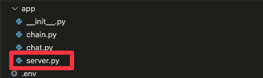

# LangServe + Heroku

## Poetry

poetry 설치

```bash
pip install poetry
```

필요한 패키지 추가

```bash
poetry add langchain-openai
```

langserve 실행

```bash
poetry run langchain serve
```

langchain-template 코드 추가

```bash
poetry run langchain app add retrieval-agent
```

langchain-template 코드 제거

```bash
poetry run langchain app remove retrieval-agent
```

## Procfile

app 패키지(폴더) 하위의 [s](http://server.py)erver.py 안에 app 으로 진입점 초기화 한다는 뜻



```bash
web: uvicorn app.server:app --host=0.0.0.0 --port=${PORT:-5000}
```

## 프로젝트 설정

1. requirements.txt 생성
    - poetry 사용시 
    
    ```bash
    poetry export -f requirements.txt --output requirements.txt --without-hashes
    ```
    
2. Procfile 생성
   - Procfile 생성 후 아래 내용을 기입
    
    ```bash
    web: uvicorn app.server:app --host=0.0.0.0 --port=${PORT:-5000}
    ```
    
3. git init
    - github 에 소스코드 업로드

## Heroku

### Install the Heroku CLI

Download and install the [Heroku CLI](https://devcenter.heroku.com/articles/heroku-command-line).

heroku 대시보드에 접속하여 새로운 앱을 생성

앱이름: `langserve-template` 으로 이미 생성해 놓았음


터미널에 heroku init

아래의 `langserve-template` 대신 본인의 앱이름을 입력 가능!

```bash
heorku git:remote -a langserve-template
```

배포

```bash
git push heroku main
```

## 환경변수

```bash
heroku config:set OPENAI_API_KEY=이곳에_API_KEY_입력
heroku config:set LANGCHAIN_TRACING_V2=true
heroku config:set LANGCHAIN_ENDPOINT=https://api.smith.langchain.com
heroku config:set LANGCHAIN_PROJECT=LANGSERVE
heroku config:set LANGCHAIN_API_KEY=이곳에_API_KEY_입력
```


# 모듈 설명

### server.py
FastAPI 를 사용한 서버 시작

### chat.py

### chain.py
